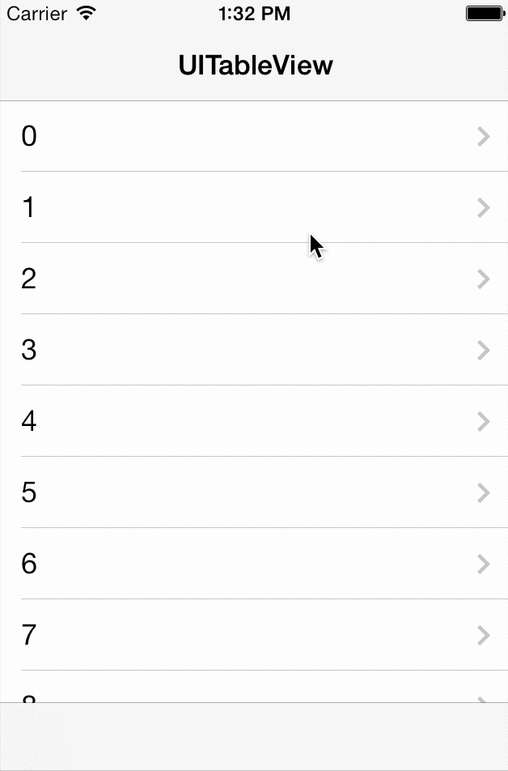

# LPScrollFullScreen

Scroll to hide navigationBar and toolBar or tabBar for making full screen effect like Facebook app
which is base on [NJKScrollFullScreen](https://github.com/ninjinkun/NJKScrollFullScreen).

# Additional

swift version is [here](https://github.com/litt1e-p/LPScrollFullScreen-swift)

##Screenshot



## Include

- use cocapods
```swift
pod 'LPScrollFullScreen', '~> 1.0.2'
```
- manual include
```swift
drag LPScrollFullScreen folder into you project
```

## Usage

>need 2 lines code only
>for example, in UITableViewController:
```swift
 //1.set LPScrollFullScreen scrollProxy for your scrollView/UITableView/UIWebView/UICollectionView
 _scrollProxy = [[LPScrollFullScreen alloc] initWithForwardTarget:self];
 //2.set it as delegate for your scrollView
 self.tableView.delegate = (id)_scrollProxy;
 //or
 self.collectionView.delegate = (id)_scrollProxy;
 //or
 self.webView.delegate = (id)_scrollProxy;
```

## Release Notes

- v1.0.2

 fix a bug of hidding tabBar & navigationBar while scrollView's contentOffset <= navigationBar's bottom
 
- v1.0.1

 add a static property value for origin navigationBar's bottom
